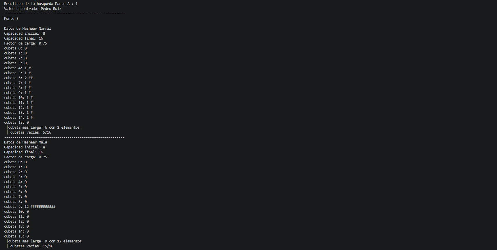
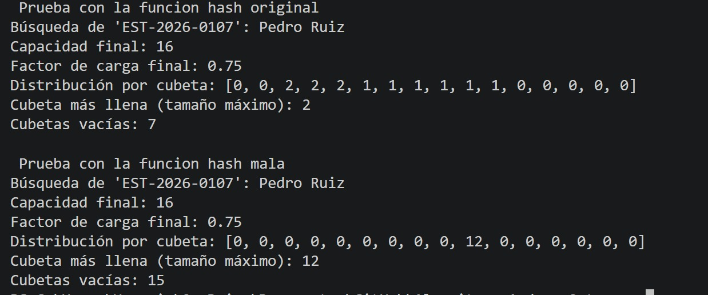

Trabajo hecho por Andres Felipe Ortegon, Asier Arguinzones

Imagen del output c++

Imagen del output python

4 
1. La función hash_mala solo evalúa los primeros 4 caracteres de la clave. Dado que todos los códigos proporcionados comparten exactamente el mismo prefijo ("EST-"), la suma de sus valores es idéntica para los 12 estudiantes. Al aplicar la operación módulo (self.cap), el resultado es el mismo índice para todos, forzando a que cada elemento colisione y se almacene en la misma cubeta.
2. No, no mejoró nada. Al redimensionar simplemente creamos una tabla más grande con más cubetas, pero el problema original sigue ahí: la función mala solo lee "EST-". Como ese inicio es idéntico para todos los códigos, la función sigue calculando exactamente el mismo valor para los 12 estudiantes. Lo único que pasa al redimensionar es que todos se mudan en grupo a una nueva cubeta, pero siguen amontonados en una sola. Esto demuestra que tener más espacio no sirve de nada si la función hash no es capaz de notar las diferencias entre las claves.
3. Con la función mala, ¿cuántas comparaciones hace buscar("EST-2026-0112") en el peor caso? ¿Y con la buena?
Buscar haria un total de O(N), en la mala ya que todas se van a la misma y en la buena realmente en el peor de los casos haria O(1)
4. ¿Qué parte del código debería mirar una buena función hash para sus claves del proyecto? 
La parte de busqueda de lo usuarios para no tener que recorrer la matriz todo el tiempo